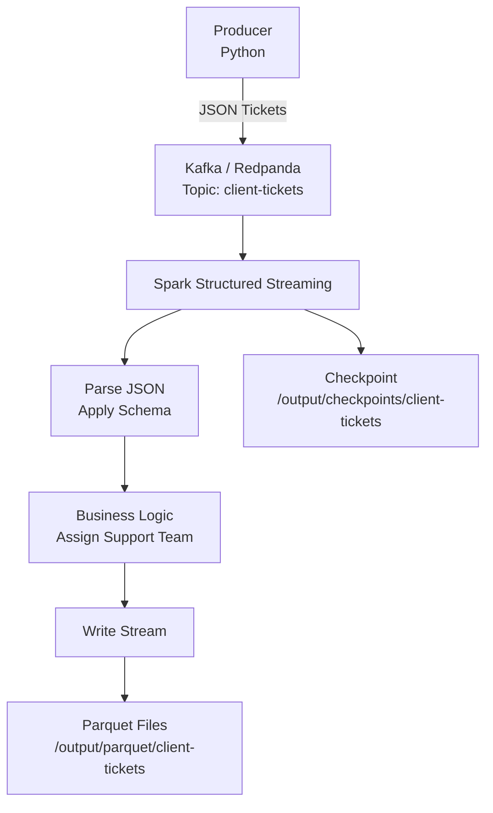

# redpanda-ticket

## Aperçu

Ce projet implémente un pipeline de données en streaming permettant de traiter des tickets clients en temps réel.

Les messages sont envoyés dans Kafka (Redpanda), traités par Apache Spark Structured Streaming, enrichis avec une logique métier (assignation d’une équipe support), puis stockés au format Parquet pour analyse.

Ce Proof of Concept démontre comment construire un pipeline temps réel simple et scalable.

## Architecture

Le pipeline fonctionne selon les étapes suivantes :

- Un producteur envoie des tickets clients au format JSON dans un topic Kafka ( Redpanda).

- Spark Structured Streaming consomme les messages.

- Les messages sont parsés selon un schéma défini.

- Une transformation enrichit les tickets avec une équipe support.

- Les données sont écrites au format Parquet.

- Un checkpoint Spark permet la reprise automatique en cas d’arrêt.

## Diagramme du pipeline de données

Les tickets envoyés dans Kafka ont le format JSON suivant :

{
  "ticket_id": uuid,
  
  "client_id": int,
  
  "created_at": datetime,
  
  "demande": string,
  
  "type_demande": string,
  
  "priorite": string
}

## Business Logic

Le pipeline assigne automatiquement une équipe support en fonction du type de demande :

| type_demande | support_team |
|--------------|--------------|
| incident     | Team A       |
| facturation  | Team B       |
| technique    | Team C       |
| autre        | Team D       |

## Lancement du Project

### 1. Démarrage Infrastructure

**docker compose up -d**

Démarre les services :

- Kafka / Redpanda

- script Producer

- script Consumer spark

### 2. Vérification Output Data

Les fichiers générés seront disponibles dans :

/output/parquet/client-tickets

### 3. Démarrage du job insight

**docker compose --profile batch run --rm spark-insight**

Démarre le service spark-insight qui calcul le nombre de tickets par type à partir des fichier parquet générés.

Les aggrégations générés seront disponibles dans :

/output/reports/tickets_by_type

## Points de contrôles Spark

Spark utilise un dossier checkpoint pour :

- stocker les offsets Kafka consommés

- garantir la tolérance aux pannes

- éviter de retraiter les mêmes données

/output/checkpoints/client-tickets

## Video de démonstration

Une courte vidéo explique :

- l’architecture du pipeline

- comment lancer le projet

- comment vérifier les données générées

▶️ Video :

[Regarder la démonstration
](https://youtu.be/YojvKA2PAgw)

## Technologies utilisées

- Apache Spark Structured Streaming

- Kafka / Redpanda

- Python

- Parquet

- Docker

- Mermaid

## Concepts clés démontrés

- Streaming data pipeline

- Kafka message ingestion

- Spark Structured Streaming

- JSON schema parsing

- Data enrichment

- Fault tolerance with checkpoints

- Data lake storage using Parquet
