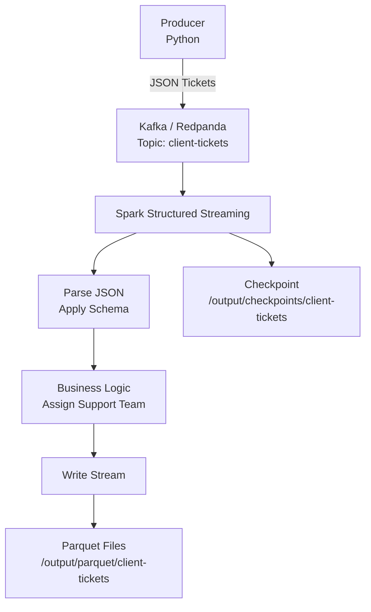

# Pipeline streaming de tickets clients — Redpanda · Spark · Parquet

> Proof of Concept d'un pipeline de données en temps réel :
> ingestion de tickets clients via Kafka (Redpanda), traitement par
> Spark Structured Streaming, enrichissement métier et stockage Parquet.

## Contexte & objectif

Ce projet démontre comment construire un pipeline streaming simple et
scalable pour traiter des tickets clients en temps réel.
Un producteur Python génère des tickets au format JSON, Spark les consomme
et les enrichit avec une logique d'assignation d'équipe support, puis les
stocke au format Parquet pour analyse batch.

## Stack technique

`Python` `Apache Spark` `Kafka / Redpanda` `Parquet` `Docker`

## Architecture du pipeline


## Structure du repo
```
├── producer/
│   ├── ticket-producer.py      # Génération et envoi de tickets vers Kafka
│   ├── requirements.txt        # Dépendances Python du producteur
│   └── Dockerfile
├── consumer/
│   ├── spark_consumer.py       # Spark Structured Streaming + écriture Parquet
│   ├── spark_insight.py        # Job batch d'agrégation sur les Parquet
│   └── Dockerfile
├── docker-compose.yml
└── README.md
```

## Format des tickets
```json
{
  "ticket_id": "uuid",
  "client_id": 42,
  "created_at": "2024-01-15T10:30:00",
  "demande": "Mon service ne fonctionne plus",
  "type_demande": "incident",
  "priorite": "haute"
}
```

## Business Logic — Assignation des équipes

| type_demande | support_team |
|---|---|
| incident | Team A |
| facturation | Team B |
| technique | Team C |
| autre | Team D |

## Lancement du projet

**1. Démarrer l'infrastructure et le pipeline**
```bash
docker compose up -d
```

Démarre :
- Kafka / Redpanda
- Le producteur Python (`ticket-producer.py`)
- Le consommateur Spark (`spark_consumer.py`)

Les fichiers Parquet sont générés dans `/output/parquet/client-tickets/`

**2. Lancer le job d'analyse batch**
```bash
docker compose --profile batch run --rm spark-insight
```

Exécute `spark_insight.py` — calcule le nombre de tickets par type
à partir des fichiers Parquet générés.

Les agrégations sont disponibles dans `/output/reports/tickets_by_type/`

**3. Explorer les données (optionnel)**

Ouvrir `consumer/read_parquet.ipynb` pour inspecter les fichiers
Parquet produits par le pipeline.

## Tolérance aux pannes — Checkpoints Spark

Spark stocke les offsets Kafka consommés dans
`/output/checkpoints/client-tickets/`, ce qui garantit :
- la reprise automatique en cas d'arrêt
- l'absence de retraitement des données déjà consommées

## Démonstration

[Regarder la vidéo de démonstration](https://youtu.be/YojvKA2PAgw)

La vidéo couvre l'architecture du pipeline, le lancement du projet
et la vérification des données générées.

## Apprentissages clés

- Construction d'un pipeline streaming bout en bout avec Spark et Kafka
- Consommation et parsing de messages JSON avec schéma explicite
- Enrichissement de données en temps réel (business logic)
- Tolérance aux pannes via checkpoints Spark
- Stockage en Data Lake avec Parquet
- Orchestration multi-conteneurs avec Docker Compose
